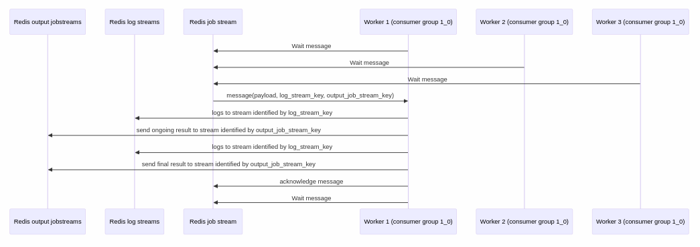

**Helps planny_model workers to dialog with redis streams in order to:**

- get a job payload
- send logs
- send ongoing results
- send final result and acknowledge message

# Flow diagram

Generated with `sequence_diagram.md` typora file (see in this repo) 

Here in the example of Worker 1 execution after it received a message.

Workers are part of the same consumer group, this means each message will only be consumer by 1 worker.

# Flow description

Here is described the Worker 1 sequence

- Worker 1 is connecting to stream named after the worker version, pattern is "<major>_<minor>_<patch>" where values are fetched from worker environement (see below)
- Worker 1 wait for a message on that stream
- Server is sending a job payload on the stream, this payload includes 3 fields:
  - payload: the job payload (aka JobSerializerData)
  - log_stream_key: the name of the stream where worker logs message are expected to be sent
  - output_job_stream_key: the name of the stream where worker ongoing output payloads and final payload are expected to be sent
- Worker 1 start running and send logs and ongoing results to expected streams
- Worker 1 finish by sending final output payload and message acknowledgement
- Worker 1 go back to job stream and wait for a new message

# Job stream

This stream is created by worker if not exists.

Since different versions of workers may exist with different expected payloads. A convention is to:
- name the stream using convention "<major>_<minor>", all workers version thats fit this are expected to be able to consume messages from this stream.
- consumer names use convention "<major>_<minor>_<patch>", so that we can identify which worker version has processed messages.

